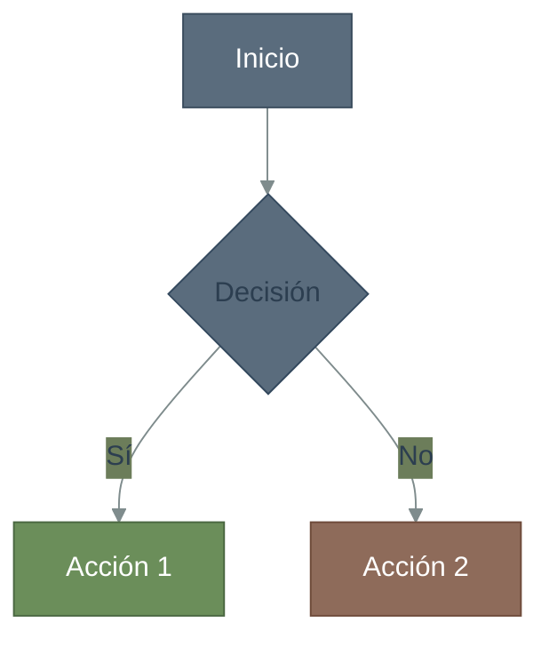
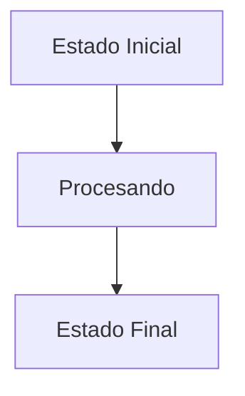
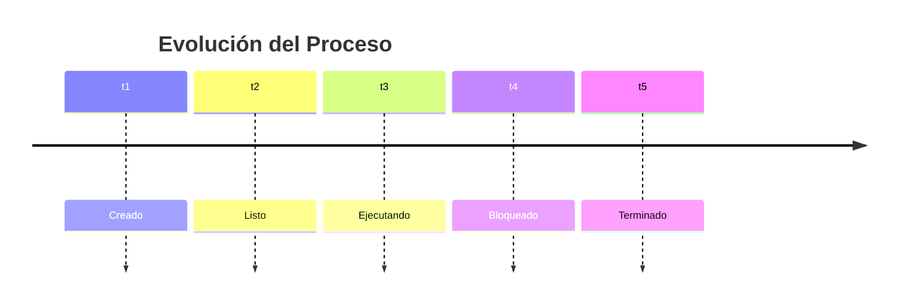
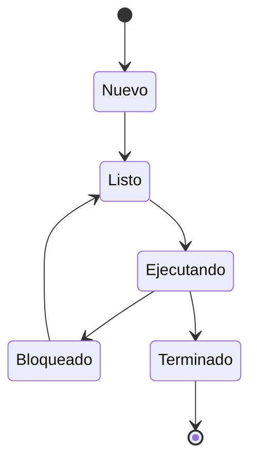

# Guía de Estilo - Libro Técnico de Sistemas Operativos

## Objetivo
Mantener consistencia visual y técnica en todo el libro, aprovechando las capacidades de Pandoc + LaTeX + plantilla Eisvogel para generar PDFs profesionales.

---

## 1. ESTRUCTURA DE CAPÍTULOS

### Encabezados y Numeración
```markdown
# Capítulo Principal (H1)
## Sección Principal (H2) 
### Subsección (H3)
#### Detalle específico (H4)
```

**✅ Correcto:** Usar solo `#` para encabezados
- Pandoc numera automáticamente con `--number-sections`
- Eisvogel maneja saltos de página automáticos
- No agregar numeración manual

**❌ Evitar:** 
- `# 2. Gestión de Procesos` (numeración manual)
- Saltos de página manuales (`\newpage`)

---

## 2. DEFINICIONES Y CONCEPTOS CLAVE

### Caja de Definición (Uso Principal)
```latex
\begin{definitionbox}
\emph{Definición:}
Mecanismo hardware que permite detener temporalmente la ejecución normal del procesador para atender un evento urgente.
\end{definitionbox}
```

**Cuándo usar:** 
- Definiciones formales de conceptos
- Teoremas o principios fundamentales
- Conceptos que el estudiante debe memorizar

**Por qué este formato:**
- Eisvogel incluye `tcolorbox` por defecto
- Visualmente destacado sin sobrecargar
- Consistente en todo el documento

---

## 3. BLOQUES DE INFORMACIÓN COLOREADA

### Ventajas (Verde Azulado Oscuro)
```latex
\textcolor{teal!60!black}{\textbf{Ventajas:}\\
- Se adapta al comportamiento del proceso\\
- Favorece procesos interactivos (I/O bound)\\
- Procesos largos eventualmente reciben servicio\\
}
```

### Desventajas (Rojo Grisáceo)
```latex
\textcolor{red!60!gray}{\textbf{Desventajas:}\\
- Complejidad alta de implementación\\
- Difícil de tunear parámetros\\
- Overhead considerable\\
}
```

### Advertencias (Naranja Oscuro)
```latex
\textcolor{orange!70!black}{\textbf{Advertencia:}\\
- Puede causar starvation en casos extremos\\
- Requiere tuning cuidadoso de parámetros\\
}
```

### Información Técnica (Azul Grisáceo)
```latex
\textcolor{blue!50!black}{\textbf{Información técnica:}\\
- PCB contiene: PID, estado, registros\\
- Context switch implica guardar/restaurar estado\\
}
```

**Reglas importantes:**
- **SIEMPRE** usar `\textbf{}` en lugar de `**texto**`
- **SIEMPRE** usar `\\` al final de cada línea
- **NO** mezclar markdown dentro de `\textcolor{}`

**Por qué no usar otras alternativas:**
- **Emojis:** Problemas de compatibilidad con fuentes en XeLaTeX
- **Callouts de markdown:** No soportados por Eisvogel
- **HTML:** Se pierde al convertir a LaTeX

---

## 4. CÓDIGO Y LISTADOS

### Código Inline
```markdown
La syscall `fork()` crea un proceso hijo.
```

### Bloques de Código
```markdown
```c
#include <stdio.h>
int main() {
    printf("Hello, OS!\n");
    return 0;
}
```
```

**Configuración automática:**
- Eisvogel usa `listings` para syntax highlighting
- `--highlight-style tango` da colores profesionales
- Numeración de líneas automática si es necesario

---

## 5. DIAGRAMAS MERMAID

### Workflow de Diagramas
1. **Crear archivo fuente:** `src/diagrams/capXX-nombreDiagrama.mmd`
2. **Makefile genera automáticamente:** `src/diagrams/capXX-nombreDiagrama.png`
3. **Insertar en markdown:** Solo referenciar la imagen PNG

### Nomenclatura de Archivos
```
src/diagrams/cap01-cicloInstruccion.mmd    → cap01-cicloInstruccion.png
src/diagrams/cap02-estadosProcesos.mmd     → cap02-estadosProcesos.png
src/diagrams/cap03-algoritmosScheduling.mmd → cap03-algoritmosScheduling.png
```

**Formato:** `capXX-descripcionCorta.mmd` (sin espacios, camelCase)

### Estructura de Archivo .mmd


### Tipos de Diagramas Recomendados

#### Flowcharts (Flujos de Procesos)

**Uso:** Algoritmos, flujo de estados, ciclo de vida de procesos

#### Timeline (Secuencias Temporales)

**Uso:** Scheduling algorithms, context switches

#### Diagramas de Estado

**Uso:** Estados de procesos, transiciones del sistema

### Inserción en Documento
```latex
\begin{center}
\includegraphics[width=0.8\linewidth,height=\textheight,keepaspectratio]{src/diagrams/cap02-sieteEstadosProcesos.png}
\end{center}
```

### Parámetros de Tamaño Recomendados
- **Diagramas horizontales:** `width=0.8\linewidth`
- **Diagramas verticales:** `width=0.6\linewidth` 
- **Diagramas complejos:** Usar layout en columnas (ver Sección 6)
- **SIEMPRE:** incluir `keepaspectratio` y `height=\textheight`

**Por qué Mermaid + PNG:**
- **Ventajas:**
  - Control total sobre styling y colores
  - Versionado del código fuente (.mmd)
  - Regeneración automática via Makefile
  - Independiente de dependencias externas en LaTeX
- **vs. TikZ:** Más simple, mejor para colaboración
- **vs. Plantillas:** Reutilizable, modificable programáticamente

### Palette de Colores para Mermaid
```mermaid
% Colores corporativos consistentes:
'primaryColor': '#5a6c7d'        % Azul grisáceo principal
'primaryTextColor': '#2c3e50'    % Texto oscuro  
'primaryBorderColor': '#34495e'  % Bordes
'lineColor': '#7f8c8d'          % Líneas de conexión

% Colores de estado:
fill:#5a6c7d  % Estados normales
fill:#6b8e5a  % Estados positivos/activos  
fill:#8e6b5a  % Estados de espera/bloqueados
fill:#7a8a9a  % Transiciones/context switches
```

### Layout en Columnas (para contenido extenso)
```latex
\begin{center}
\begin{minipage}{0.55\linewidth}
    [Texto explicativo aquí]
\end{minipage}%
\hspace{0.05\linewidth}%
\begin{minipage}{0.35\linewidth}
    \includegraphics[width=\linewidth,keepaspectratio]{imagen.png}
\end{minipage}
\end{center}
```

**Por qué este formato:**
- `keepaspectratio` evita distorsión
- `\textheight` limita altura máxima
- `center` environment mantiene consistencia
- **No usar** markdown `` porque limita control de tamaño

---

## 6. LISTAS Y ENUMERACIONES

### Listas con Viñetas
```markdown
- Elemento 1
- Elemento 2
  - Sub-elemento
- Elemento 3
```

### Listas Numeradas
```markdown
1. Primer paso
2. Segundo paso
3. Tercer paso
```

### Listas de Verificación (sin emojis)
```markdown
**Checklist de implementación:**
- [x] Implementar PCB
- [x] Crear scheduler básico
- [ ] Agregar priority aging
- [ ] Optimizar context switch
```

**Por qué no usar emojis:**
- Problemas de renderización en XeLaTeX
- Dependencias adicionales de fuentes
- Los símbolos `[x]` y `[ ]` son universalmente compatibles

---

## 7. TABLAS

### Formato Estándar
```markdown
| Algoritmo | Preemptivo | Complejidad | Starvation |
|-----------|------------|-------------|------------|
| FCFS      | No         | O(1)        | No         |
| SJF       | No         | O(n log n)  | Sí         |
| RR        | Sí         | O(1)        | No         |
```

**Eisvogel formatea automáticamente las tablas con estilo profesional**

---

## 8. REFERENCIAS Y CITAS

### Referencias a Figuras
```markdown
Como se observa en la Figura 2.1, el proceso pasa por múltiples estados.
```

### Referencias a Secciones
```markdown
Ver Sección 3.2 para detalles de implementación.
```

**Eisvogel maneja la numeración automática de figuras y secciones**

---

## 9. MATEMÁTICAS Y FÓRMULAS

### Fórmulas Inline
```markdown
El tiempo de espera promedio es $W = \frac{\sum_{i=1}^{n} W_i}{n}$.
```

### Fórmulas en Bloque
```markdown
$$
\text{Throughput} = \frac{\text{Procesos completados}}{\text{Tiempo total}}
$$
```

---

## 10. METADATOS Y CONFIGURACIÓN

### metadata.yaml requerido
```yaml
book: true
classoption: "oneside"
papersize: "a4"
figureTitle: "Figura"
figureAlign: center

header-includes: |
  \usepackage{float}
  \usepackage{tcolorbox}
  \newtcolorbox{definitionbox}{colback=blue!5!white,colframe=blue!50!white,boxrule=0.5pt,arc=2pt,left=6pt,right=6pt,top=6pt,bottom=6pt}
  \floatplacement{figure}{H}
  \usepackage{xcolor}
  \setmainfont{DejaVu Sans}
```

### Comando de compilación
```bash
pandoc $(COMBINED_MD) \
  -o $(OUTPUT_DIR)/$(BOOK_NAME).pdf \
  --from markdown \
  --template templates/eisvogel.latex \
  --pdf-engine xelatex \
  --top-level-division="chapter" \
  --number-sections \
  --highlight-style tango \
  --listings \
  --shift-heading-level-by=0 \
  --verbose
```

---

## 11. PALETTE DE COLORES APROBADA

### Para Ventajas/Positivo
- `\textcolor{teal!60!black}{}` (verde azulado profesional)
- `\textcolor{green!40!black}{}` (verde oscuro)

### Para Desventajas/Negativo  
- `\textcolor{red!60!gray}{}` (rojo grisáceo)
- `\textcolor{red!50!black}{}` (rojo oscuro)

### Para Advertencias
- `\textcolor{orange!70!black}{}` (naranja profesional)

### Para Información
- `\textcolor{blue!50!black}{}` (azul oscuro)

### Para Código/Técnico
- `\textcolor{violet!60!black}{}` (violeta profesional)

---

## 12. CHECKLIST PRE-COMMIT

Antes de hacer commit verificar:

- [ ] Todos los encabezados usan solo `#` (sin numeración manual)
- [ ] Bloques de color usan `\textbf{}` y `\\` 
- [ ] Imágenes usan `\includegraphics` con `keepaspectratio`
- [ ] Diagramas .mmd tienen su correspondiente .png
- [ ] Definiciones importantes usan `\begin{definitionbox}`
- [ ] No hay emojis unicode (reemplazar por texto o símbolos LaTeX)
- [ ] Tablas usan formato markdown estándar
- [ ] Fórmulas usan sintaxis LaTeX ($..$ o $$..$$)

---

## 13. RECURSOS Y TROUBLESHOOTING

### Errores Comunes
1. **"Missing character"**: Emoji o carácter no soportado por fuente
   - **Solución**: Usar símbolos LaTeX o texto descriptivo

2. **"Undefined control sequence"**: Comando LaTeX mal escrito
   - **Solución**: Verificar sintaxis de `\textcolor`, `\textbf`, etc.

3. **Imagen no aparece**: Ruta incorrecta o archivo no existe
   - **Solución**: Verificar que .png existe y ruta es correcta

### Comandos de Emergencia
```bash
# Limpiar archivos temporales
make clean

# Compilar solo un capítulo para debugging
pandoc capitulo-02.md -o test.pdf --pdf-engine xelatex

# Ver log detallado de errores
pandoc ... --verbose 2>&1 | tee build.log
```

---

**Este documento debe estar en `.gitignore` y servir como referencia rápida para mantener la consistencia del proyecto.**