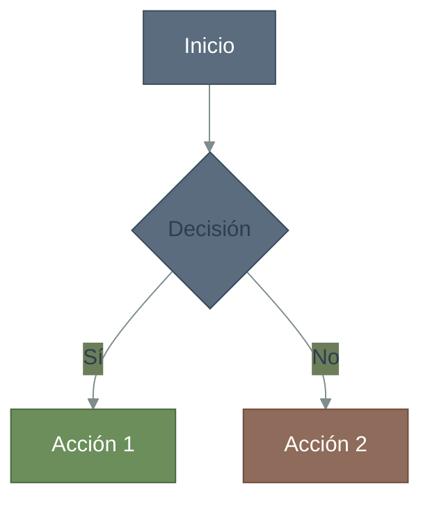
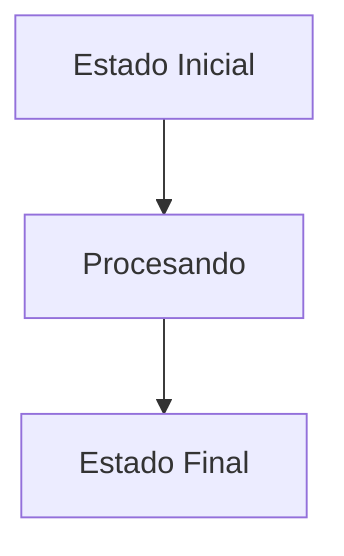
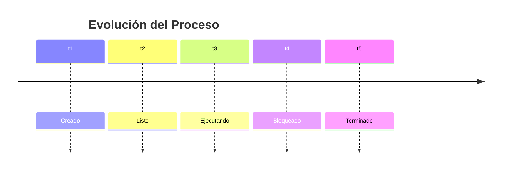
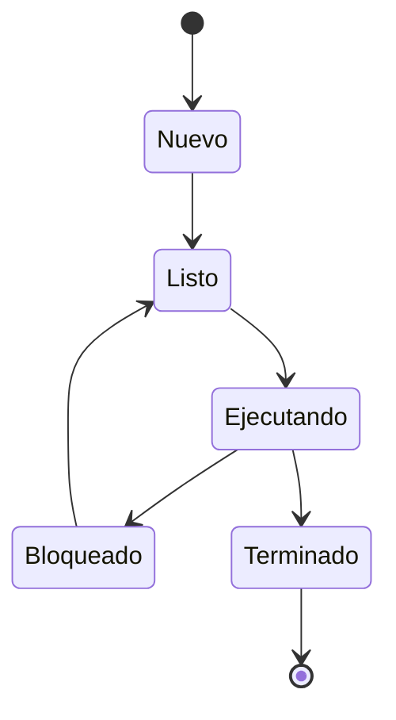

# Guía de Estilo - Libro Técnico de Sistemas Operativos

## Objetivo
Mantener consistencia visual y técnica en todo el libro, aprovechando las capacidades de Pandoc + LaTeX + plantilla Eisvogel para generar PDFs profesionales.

---

## 1. ESTRUCTURA DE CAPÍTULOS

### Encabezados y Numeración
```markdown
# Capítulo Principal (H1)
## Sección Principal (H2) 
### Subsección (H3)
#### Detalle específico (H4)
```

**✅ Correcto:** Usar solo `#` para encabezados
- Pandoc numera automáticamente con `--number-sections`
- Eisvogel maneja saltos de página automáticos
- No agregar numeración manual

**❌ Evitar:** 
- `# 2. Gestión de Procesos` (numeración manual)
- Saltos de página manuales (`\newpage`)

---

## 2. ÉNFASIS Y FORMATEO DE TEXTO

### Comandos LaTeX para Énfasis (Uso Real)

**Importante:** Dentro de bloques LaTeX (`\begin{theory}`, `\begin{highlight}`, etc.), **SIEMPRE** usar comandos LaTeX, NO markdown.

```latex
\textbf{Texto en bold}              % Bold (letra gruesa)
\textit{Texto en itálica}           % Itálica (letra inclinada)
\emph{Texto enfatizado}             % Énfasis (generalmente itálica)
\texttt{texto monoespaciado}        % Código inline
```

### Combinaciones de Énfasis (Patrones Reales)

Dentro de bloques de contenido, es común combinar énfasis:

```latex
% Importante: Bold + Texto normal con énfasis
Estas condiciones son \textbf{suficientes}: que se cumplan las cuatro no \emph{garantiza} que haya deadlock.

% Bold + Énfasis combinados
La condición \textbf{\emph{espera circular}} en un sistema que ya cumple las otras tres.

% Bold con paréntesis explicativos
El \textbf{PCB} (Process Control Block) contiene toda la información del proceso.

% Negación con énfasis
Un proceso es \textbf{NO} preemptivo cuando el SO no puede interrumpirlo.
```

### Cuándo usar Cada Uno

| Comando | Uso | Ejemplo |
|---------|-----|---------|
| `\textbf{}` | Conceptos importantes, términos clave | `\textbf{Process Control Block}` |
| `\textit{}` | Énfasis suave, nombres en idioma extranjero | `\textit{Block Started by Symbol}` |
| `\emph{}` | Énfasis dentro de párrafos narrativos | `no \emph{garantiza} que haya deadlock` |
| `\texttt{}` | Nombres de funciones, syscalls, variables | `la syscall \texttt{fork()}` |

**Regla de Oro:** No combinar más de 2 niveles de énfasis; si necesitas más, probablemente necesites una caja o bloque separado.

---

## 3. BLOQUES DE CONTENIDO

### Tipos de Bloques Disponibles (Con Ejemplos Reales)

Eisvogel soporta los siguientes bloques personalizados, cada uno con un propósito específico:

#### 3.1 `\begin{theory}...\end{theory}` - Contenido Teórico
**Uso:** Conceptos fundamentales, principios teóricos, definiciones formales.

```latex
\begin{theory}
La característica distintiva de la arquitectura de von Neumann es que \textit{programa 
y datos comparten el mismo espacio de memoria}. Esto permite que los programas sean 
tratados como datos, habilitando conceptos como compiladores e intérpretes que pueden 
cargar y ejecutar otros programas dinámicamente.
\end{theory}
```

**Cuándo usar:** Cuando presentas conceptos que son la base teórica de lo que sigue.

---

#### 3.2 `\begin{highlight}...\end{highlight}` - Definición Clave
**Uso:** Definiciones cortas, conceptos que deben memorizarse, puntos críticos.

```latex
\begin{highlight}
Un proceso es un programa en ejecución. No es solo el código, sino también el estado 
completo de esa ejecución: variables, memoria asignada, archivos abiertos, posición 
en el código. El sistema operativo mantiene toda esta información y la restaura cada 
vez que le toca el turno al proceso.
\end{highlight}
```

**Cuándo usar:** Para definiciones operacionales o conceptos que el estudiante debe poder citar textualmente.

---

#### 3.3 `\begin{example}...\end{example}` - Ejemplos Concretos
**Uso:** Casos de uso específicos, ejemplos prácticos, ilustraciones concretas de conceptos abstractos.

```latex
\begin{example}
Cuando guardás un archivo de texto de 1KiB, el sistema operativo decide en qué 
sectores del disco físico va a almacenarlo, actualiza las estructuras de metadatos 
que permiten encontrarlo después, y registra toda la operación para poder recuperarse 
si hay un fallo.
\end{example}
```

**Cuándo usar:** Para concretizar conceptos abstractos con situaciones del mundo real.

---

#### 3.4 `\begin{warning}...\end{warning}` - Advertencias
**Uso:** Errores comunes, trampas, situaciones peligrosas, confusiones frecuentes.

```latex
\begin{warning}
Es común confundir multiprogramación con multitarea. La diferencia clave está en la 
preemption: en multiprogramación pura, un proceso solo cede la CPU voluntariamente. 
En multitarea, el sistema operativo puede quitarle la CPU a un proceso en cualquier 
momento.
\end{warning}
```

**Cuándo usar:** Cuando hay una confusión común o un error típico que los estudiantes cometen.

---

#### 3.5 `\begin{infobox}...\end{infobox}` - Información Adicional
**Uso:** Información complementaria, contexto, datos interesantes, notas administrativas.

```latex
\begin{infobox}
En sistemas modernos, el grado de multiprogramación puede ser de cientos o incluso 
miles de procesos. Linux, por ejemplo, puede manejar fácilmente 10,000 procesos en 
hardware adecuado. Sin embargo, solo unos pocos estarán realmente activos.
\end{infobox}
```

**Cuándo usar:** Para información que enriquece pero no es crítica para comprender el concepto principal.

---

#### 3.6 `\begin{excerpt}...\end{excerpt}` - Citas o Fragmentos
**Uso:** Citas de otros autores, fragmentos de documentación oficial, textos históricos.

```latex
\begin{excerpt}
Licencia y Filosofía Colaborativa: Este libro se distribuye bajo Creative Commons 
BY-SA 4.0, lo que significa que es libre de usar, modificar y redistribuir.
\end{excerpt}
```

**Cuándo usar:** Para distinguir contenido que es una cita o que viene de una fuente externa.

---

#### 3.7 `\begin{definitionbox}...\end{definitionbox}` - Definiciones Formales
**Uso:** Definiciones técnicas precisas que deben ser memorizadas textualmente.

```latex
\begin{definitionbox}
\emph{Definición:}
La planificación de procesos es el mecanismo mediante el cual el sistema operativo 
decide qué proceso de la cola de listos (READY) debe ejecutarse a continuación en 
el CPU.
\end{definitionbox}
```

**Cuándo usar:** Para definiciones que tienen un carácter formal o que aparecerán en exámenes.

---

### Énfasis dentro de Bloques (Patrones Avanzados)

Dentro de cualquier bloque de contenido, puedes usar énfasis para destacar conceptos:

```latex
\begin{theory}
Estas condiciones son necesarias: sin ellas, no hay deadlock. Pero no son 
\textbf{suficientes}: que se cumplan las cuatro no \emph{garantiza} que haya deadlock, 
porque quizás los procesos liberen recursos antes de que se forme el ciclo. La 
condición \textbf{suficiente} para deadlock es \emph{\textbf{espera circular}} en 
un sistema que ya cumple las otras tres.
\end{theory}
```

**Patrón:** 
- Usa `\textbf{}` para términos técnicos importantes
- Usa `\emph{}` para énfasis suave dentro de la prosa
- Combina como `\emph{\textbf{término}}` solo cuando necesites máximo énfasis

---

## 4. BLOQUES DE INFORMACIÓN COLOREADA (CON LISTAS)

Para resaltar información en formato de lista con colores, usa `\textcolor{}` con `\\` para saltos de línea:

### Ventajas (Verde Azulado Oscuro)
```latex
\textcolor{teal!60!black}{\textbf{Ventajas:}\\
- Se adapta al comportamiento del proceso\\
- Favorece procesos interactivos (I/O bound)\\
- Procesos largos eventualmente reciben servicio\\
}
```

### Desventajas (Rojo Grisáceo)
```latex
\textcolor{red!60!gray}{\textbf{Desventajas:}\\
- Complejidad alta de implementación\\
- Difícil de tunear parámetros\\
- Overhead considerable\\
}
```

### Advertencias (Naranja Oscuro)
```latex
\textcolor{orange!70!black}{\textbf{Advertencia:}\\
- Puede causar starvation en casos extremos\\
- Requiere tuning cuidadoso de parámetros\\
}
```

### Información Técnica (Azul Grisáceo)
```latex
\textcolor{blue!50!black}{\textbf{Información técnica:}\\
- PCB contiene: PID, estado, registros\\
- Context switch implica guardar/restaurar estado\\
}
```

**Reglas Críticas:**
- **SIEMPRE** usar `\textbf{}` en lugar de `**texto**`
- **SIEMPRE** usar `\\` al final de cada línea dentro de `\textcolor{}`
- **NUNCA** mezclar markdown dentro de `\textcolor{}`
- Cerrar con `\}` obligatoriamente

**Por qué no usar otras alternativas:**
- **Emojis:** Problemas de compatibilidad con fuentes en XeLaTeX
- **Callouts de markdown:** No soportados por Eisvogel
- **HTML:** Se pierde al convertir a LaTeX

---

## 5. INSERCIÓN DE IMÁGENES

### Patrón Estándar de Inserción (Recomendado)

El patrón real usado en los capítulos es:

```latex
\begin{center}
\includegraphics[width=0.9\linewidth,keepaspectratio]{src/images/capitulo-01/01.png}

\vspace{0.3em}
{\small\itshape\color{gray!65}
Diagrama de la arquitectura básica de una computadora, basado en el modelo de 
von Neumann, donde se muestran los principales componentes del sistema y su 
interconexión: CPU, memoria principal y dispositivos de entrada/salida.
}
\end{center}
```

**Desglose del patrón:**
- `\begin{center}...\end{center}` — Centra la imagen
- `\includegraphics[width=...,keepaspectratio]{ruta}` — Inserta la imagen
  - `width=0.9\linewidth` — Tamaño (ver tabla abajo)
  - `keepaspectratio` — **SIEMPRE** incluir para evitar distorsión
- `\vspace{0.3em}` — Pequeño espacio entre imagen y caption
- `{\small\itshape\color{gray!65}...}` — Caption con formato especial:
  - `\small` — Texto pequeño (relacionado)
  - `\itshape` — Itálica
  - `\color{gray!65}` — Gris claro para que se vea como una etiqueta

### Parámetros de Tamaño (Patrones Reales)

| Tipo de Contenido | Ancho | Parámetros | Ejemplo |
|-------------------|-------|-----------|---------|
| Imágenes normales | 0.9\linewidth | `[width=0.9\linewidth,keepaspectratio]` | Diagramas, screenshots |
| Tablas grandes | \linewidth | `[width=\linewidth,height=\textheight,keepaspectratio]` | Tablas de procesos |
| Imágenes pequeñas | 0.6\linewidth | `[width=0.6\linewidth,keepaspectratio]` | Iconos, detalles |
| Imágenes con texto | 0.8\linewidth | `[width=0.8\linewidth,height=\textheight,keepaspectratio]` | Diagramas con etiquetas |

**Regla de Oro:** `keepaspectratio` es **obligatorio** en todos los casos.

### Imágenes Dentro de Columnas (Layout Multi-Columna)

Para combinar texto explicativo con una imagen:

```latex
\begin{center}
\begin{minipage}{0.55\linewidth}  
El \textbf{heap} es donde vive la memoria dinámica solicitada por el proceso 
mediante funciones como \texttt{malloc()} o el operador \texttt{new}. Crece 
hacia direcciones de memoria altas según el proceso solicita más memoria.

El \textbf{stack} contiene variables locales de funciones, parámetros pasados 
a funciones, direcciones de retorno, y frame pointers.
\end{minipage}%
\hspace{0.05\linewidth}%
\begin{minipage}{0.35\linewidth}
\includegraphics[width=\linewidth,keepaspectratio]{src/images/capitulo-02/layout-memoria.jpg}
\end{minipage}
\end{center}
```

**Notas importantes:**
- El `%` al final de `\end{minipage}` elimina espacios en blanco
- `\hspace{0.05\linewidth}` da separación entre columnas
- Total debe sumar ≈ 1.0: 0.55 + 0.05 + 0.35 = 0.95 (con margen)
- La imagen siempre va en la `minipage` derecha

### Rutas de Imágenes

```
src/images/
├── capitulo-01/          # Imágenes del capítulo 1
│   ├── 01.png           # Arquitectura von Neumann
│   └── ...
├── capitulo-02/
│   ├── sequential.jpg
│   ├── pipelined.jpg
│   ├── layout-memoria.jpg
│   └── ...

src/diagrams/            # Diagramas generados por Mermaid
├── cap01-cicloInstruccion.png
├── cap02-cincoEstadosProcesos.png
└── ...

src/tables/              # Tablas exportadas a PNG
├── cap02-processTable.png
├── cap02-memoryTable.png
└── ...
```

**Regla de rutas:** Usar rutas relativas desde la raíz del proyecto: `src/images/...`

---

## 6. CÓDIGO Y LISTADOS

### Código Inline
```markdown
La syscall `fork()` crea un proceso hijo.
```

### Bloques de Código
```markdown
```c
#include <stdio.h>
int main() {
    printf("Hello, OS!\n");
    return 0;
}
```
```

**Configuración automática:**
- Eisvogel usa `listings` para syntax highlighting
- `--highlight-style tango` da colores profesionales
- Numeración de líneas automática si es necesario

---

## 7. DIAGRAMAS MERMAID

### Workflow de Diagramas
1. **Crear archivo fuente:** `src/diagrams/capXX-nombreDiagrama.mmd`
2. **Makefile genera automáticamente:** `src/diagrams/capXX-nombreDiagrama.png`
3. **Insertar en markdown:** Solo referenciar la imagen PNG

### Nomenclatura de Archivos
```
src/diagrams/cap01-cicloInstruccion.mmd    → cap01-cicloInstruccion.png
src/diagrams/cap02-estadosProcesos.mmd     → cap02-estadosProcesos.png
src/diagrams/cap03-algoritmosScheduling.mmd → cap03-algoritmosScheduling.png
```

**Formato:** `capXX-descripcionCorta.mmd` (sin espacios, camelCase)

### Estructura de Archivo .mmd

```mermaid
%%{init: {'theme':'base', 'themeVariables': { 
  'primaryColor': '#5a6c7d', 
  'primaryTextColor': '#2c3e50', 
  'primaryBorderColor': '#34495e', 
  'lineColor': '#7f8c8d'
}}}%%
flowchart TD
    A[Inicio] --> B{Decisión}
    B -->|Sí| C[Acción 1]
    B -->|No| D[Acción 2]
    
    style A fill:#5a6c7d,stroke:#3a4c5d,color:#fff
    style C fill:#6b8e5a,stroke:#4a6741,color:#fff
    style D fill:#8e6b5a,stroke:#6e4b3a,color:#fff
```

### Tipos de Diagramas Recomendados

#### Flowcharts (Flujos de Procesos)

```mermaid
flowchart TD
    A[Estado Inicial] --> B[Procesando]
    B --> C[Estado Final]
```
**Uso:** Algoritmos, flujo de estados, ciclo de vida de procesos

#### Timeline (Secuencias Temporales)

```mermaid
timeline
    title Evolución del Proceso
    t1 : Creado
    t2 : Listo
    t3 : Ejecutando
    t4 : Bloqueado
    t5 : Terminado
```
**Uso:** Scheduling algorithms, context switches

#### Diagramas de Estado

```mermaid
stateDiagram-v2
    [*] --> Nuevo
    Nuevo --> Listo
    Listo --> Ejecutando
    Ejecutando --> Bloqueado
    Bloqueado --> Listo
    Ejecutando --> Terminado
    Terminado --> [*]
```
**Uso:** Estados de procesos, transiciones del sistema

### Inserción en Documento
La configuracióń de metadata.yaml se ocupa del formato.  
```latex
\includegraphics[width=0.8\linewidth,height=\textheight,keepaspectratio]{src/diagrams/cap02-sieteEstadosProcesos.png}
```

### Parámetros de Tamaño Recomendados
- **Diagramas horizontales:** `width=0.8\linewidth`
- **Diagramas verticales:** `width=0.6\linewidth` 
- **Diagramas complejos:** Usar layout en columnas (ver Sección 6)
- **SIEMPRE:** incluir `keepaspectratio` y `height=\textheight`

**Por qué Mermaid + PNG:**
- **Ventajas:**
  - Control total sobre styling y colores
  - Versionado del código fuente (.mmd)
  - Regeneración automática via Makefile
  - Independiente de dependencias externas en LaTeX
- **vs. TikZ:** Más simple, mejor para colaboración
- **vs. Plantillas:** Reutilizable, modificable programáticamente

### Palette de Colores para Mermaid
```mermaid
% Colores corporativos consistentes:
'primaryColor': '#5a6c7d'        % Azul grisáceo principal
'primaryTextColor': '#2c3e50'    % Texto oscuro  
'primaryBorderColor': '#34495e'  % Bordes
'lineColor': '#7f8c8d'          % Líneas de conexión

% Colores de estado:
fill:#5a6c7d  % Estados normales
fill:#6b8e5a  % Estados positivos/activos  
fill:#8e6b5a  % Estados de espera/bloqueados
fill:#7a8a9a  % Transiciones/context switches
```

### Layout en Columnas (para contenido extenso)
```latex
\begin{center}
\begin{minipage}{0.55\linewidth}
    [Texto explicativo aquí]
\end{minipage}%
\hspace{0.05\linewidth}%
\begin{minipage}{0.35\linewidth}
    \includegraphics[width=\linewidth,keepaspectratio]{imagen.png}
\end{minipage}
\end{center}
```

**Por qué este formato:**
- `keepaspectratio` evita distorsión
- `\textheight` limita altura máxima
- `center` environment mantiene consistencia
- **No usar** markdown `` porque limita control de tamaño

---

## 8. LISTAS Y ENUMERACIONES

### Listas con Viñetas
```markdown
- Elemento 1
- Elemento 2
  - Sub-elemento
- Elemento 3
```

### Listas Numeradas
```markdown
1. Primer paso
2. Segundo paso
3. Tercer paso
```

### Listas de Verificación (sin emojis)
```markdown
**Checklist de implementación:**
- [x] Implementar PCB
- [x] Crear scheduler básico
- [ ] Agregar priority aging
- [ ] Optimizar context switch
```

**Por qué no usar emojis:**
- Problemas de renderización en XeLaTeX
- Dependencias adicionales de fuentes
- Los símbolos `[x]` y `[ ]` son universalmente compatibles

---

## 9. TABLAS

### Formato Estándar
```markdown
| Algoritmo | Preemptivo | Complejidad | Starvation |
|-----------|------------|-------------|------------|
| FCFS      | No         | O(1)        | No         |
| SJF       | No         | O(n log n)  | Sí         |
| RR        | Sí         | O(1)        | No         |
```

**Eisvogel formatea automáticamente las tablas con estilo profesional**

---

## 10. REFERENCIAS Y CITAS

### Referencias a Figuras
```markdown
Como se observa en la Figura 2.1, el proceso pasa por múltiples estados.
```

### Referencias a Secciones
```markdown
Ver Sección 3.2 para detalles de implementación.
```

**Eisvogel maneja la numeración automática de figuras y secciones**

---

## 11. MATEMÁTICAS Y FÓRMULAS

### Fórmulas Inline
```markdown
El tiempo de espera promedio es $W = \frac{\sum_{i=1}^{n} W_i}{n}$.
```

### Fórmulas en Bloque
```markdown
$$
\text{Throughput} = \frac{\text{Procesos completados}}{\text{Tiempo total}}
$$
```

---

## 12. METADATOS Y CONFIGURACIÓN

### metadata.yaml requerido
```yaml
book: true
classoption: "oneside"
papersize: "a4"
figureTitle: "Figura"
figureAlign: center

header-includes: |
  \usepackage{float}
  \usepackage{tcolorbox}
  \newtcolorbox{definitionbox}{colback=blue!5!white,colframe=blue!50!white,boxrule=0.5pt,arc=2pt,left=6pt,right=6pt,top=6pt,bottom=6pt}
  \floatplacement{figure}{H}
  \usepackage{xcolor}
  \setmainfont{DejaVu Sans}
```

### Comando de compilación
```bash
pandoc $(COMBINED_MD) \
  -o $(OUTPUT_DIR)/$(BOOK_NAME).pdf \
  --from markdown \
  --template templates/eisvogel.latex \
  --pdf-engine xelatex \
  --top-level-division="chapter" \
  --number-sections \
  --highlight-style tango \
  --listings \
  --shift-heading-level-by=0 \
  --verbose
```

---

## 13. PALETTE DE COLORES APROBADA

### Para Ventajas/Positivo
- `\textcolor{teal!60!black}{}` (verde azulado profesional)
- `\textcolor{green!40!black}{}` (verde oscuro)

### Para Desventajas/Negativo  
- `\textcolor{red!60!gray}{}` (rojo grisáceo)
- `\textcolor{red!50!black}{}` (rojo oscuro)

### Para Advertencias
- `\textcolor{orange!70!black}{}` (naranja profesional)

### Para Información
- `\textcolor{blue!50!black}{}` (azul oscuro)

### Para Código/Técnico
- `\textcolor{violet!60!black}{}` (violeta profesional)

---

## 14. CHECKLIST PRE-COMMIT

Antes de hacer commit verificar:

- [ ] Todos los encabezados usan solo `#` (sin numeración manual)
- [ ] Bloques de color usan `\textbf{}` y `\\` 
- [ ] Imágenes usan `\includegraphics` con `keepaspectratio`
- [ ] Diagramas .mmd tienen su correspondiente .png
- [ ] Definiciones importantes usan `\begin{definitionbox}`
- [ ] No hay emojis unicode (reemplazar por texto o símbolos LaTeX)
- [ ] Tablas usan formato markdown estándar
- [ ] Fórmulas usan sintaxis LaTeX ($..$ o $$..$$)

---

## 15. RECURSOS Y TROUBLESHOOTING

### Errores Comunes
1. **"Missing character"**: Emoji o carácter no soportado por fuente
   - **Solución**: Usar símbolos LaTeX o texto descriptivo

2. **"Undefined control sequence"**: Comando LaTeX mal escrito
   - **Solución**: Verificar sintaxis de `\textcolor`, `\textbf`, etc.

3. **Imagen no aparece**: Ruta incorrecta o archivo no existe
   - **Solución**: Verificar que .png existe y ruta es correcta

### Comandos de Emergencia
```bash
# Limpiar archivos temporales
make clean

# Compilar solo un capítulo para debugging
pandoc capitulo-02.md -o test.pdf --pdf-engine xelatex

# Ver log detallado de errores
pandoc ... --verbose 2>&1 | tee build.log
```

---

**Este documento debe estar en `.gitignore` y servir como referencia rápida para mantener la consistencia del proyecto.**